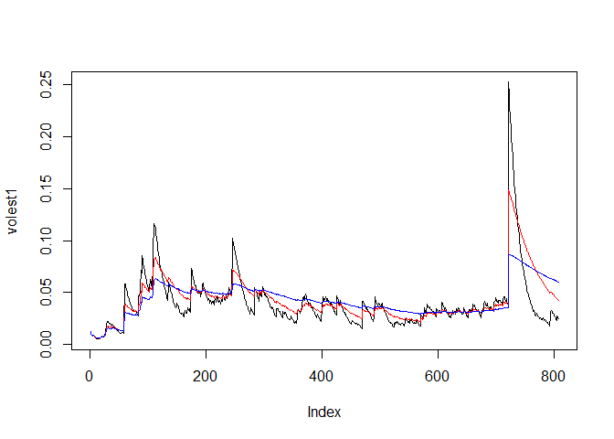

# LVitovskyBLT9_5
L_Vitovsky  
July 17, 2016  

## Introduction

GW Pharmaceuticals is a biopharmaceutical company founded in 1998 and based out of the United Kingdom.  It operates out of the "UK, Europe, the United States, Canada, and Asia" (finance.yahoo.com).  The company engages in researching,developing, and commercializing "cannabinoid precription medicines".

##Assignment

  * Download the data
  * Calculate log returns
  * Calculate volatility measures
  * Calculate volatility over entire length of series for various three day difference decay factors
  * Plot the results, overlaying the volatility curves on the data
  
  
##Code

Download the data and calculate the log returns.
  
  

```r
library(tseries)
GWPHdata <- get.hist.quote('gwph', quote="Close")
```

```
## time series starts 2013-05-01
## time series ends   2016-07-15
```

```r
GWPHret <- log(lag(GWPHdata)) - log(GWPHdata)
```

There are 809 quotes available from the download.  After taking the log of the lagging close prices, there are 808 log returns to work with.

Volatility was then calculated...


```r
GWPHvol <- sd(GWPHret)*sqrt(250)*100
```

The volatility of the log returns was calculated over the entire time series, which generated a value of 76.3432409 .  A plot of the data is below.


```r
plot(GWPHret)
```

<!-- -->

As one can see, this stock has definitely experienced some volatility over its lifetime, particularly in the beginning of its being publicly traded (IPO), and most recently.  Given the asset class (healthcare), it is not unusual to see this type of volatility.  Perhaps there was an FDA decision, a legal/political decision regarding Cannibis, or even management changes that affected the stock price during its lifetime.  It seems to "calm down" after some initial public offering volatility, but then picked up remarkably in 2016.

Now we will examine what happens when we exponentially down-weight older returns.


```r
Vol <- function (d, logrets) {
  var=0
  lam=0
  varlist <- c()
  for (r in logrets) {
    lam = lam*(1-1/d) + 1
    var=(1 - 1/lam)*var + (1/lam)*r^2
    varlist <- c(varlist,var)
  }
  sqrt(varlist)
}
volest1 <- Vol(10,GWPHret)
volest2 <- Vol(30, GWPHret)
volest3 <- Vol(100, GWPHret)
plot(volest1, type="l")
lines(volest2, type = "l", col="red")
lines(volest3, type = "l", col="blue")
```

<!-- -->

The black line is applying a weight of .9, the red a weight of .96, and the blue a weight of .99.  This, if we reduce the effect of older returns, we reduce the overall volatility.  Even there has been significant short term volatility this year, the overall volatility noticeably lowered after changing the weight of older returns.   This supports the idea that large volatility has not been existent regularly, that there were periods of lower volatility that lasted long enough to have in impact on these weighted measures.

##Conclusion

GWPH would be considered a volatile stock, which is not surprising given its product and asset class.  It is certainly not recommended for the faint of heart.  Indeed, it 52 week range was $35.83 - 126.47.  After some internet research, I found that this has been a very busy year for them as they work to develop treatments for many chronic diseases through their drug Epidiolex.  Most notably, they had favorable results from phase 3 of a trial of Epidiolex, which showed with "high statistical significance that Epidiolex treatment reduces drop seizures compared to placebo"(GlobalNewsWire.com).
